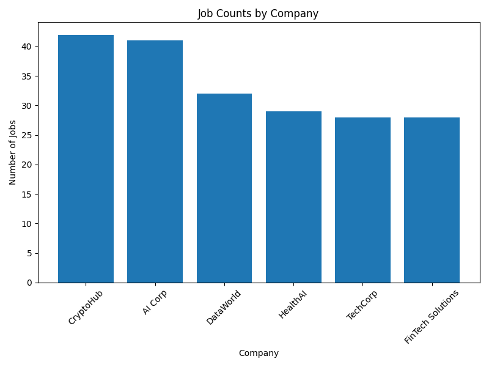
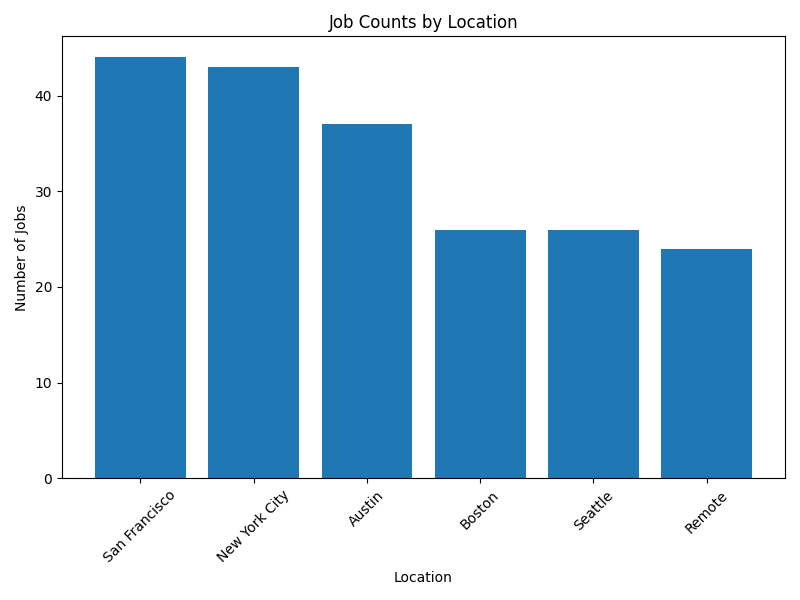

# **Job Scraping Simulation**

## **Overview**
This project simulates web scraping for job data using a mock REST API built with Flask. The project demonstrates the entire data pipeline:
1. **Serving data**: A Flask API serves 200 mock job listings.
2. **Fetching data**: A Python script simulates scraping the API and saves the results as a CSV file.
3. **Analyzing data**: Visualizations and insights are generated from the collected data.

This project highlights:
- Python scripting for data scraping and processing.
- API development and interaction.
- Basic data visualization for insights.
- Use of a structured development workflow, suitable for data analytics and software engineering roles.

---


# Project Structure

- **Job_Scraping_Simulation/**
  - `README.md`: Project documentation
  - **mock_api/**
    - `app.py`: Flask app file to serve mock job data
  - `mock_jobs_data.json`: JSON file containing 200 mock job listings
  - `simulateScrapingFromAPI.py`: Script to fetch job data from the API
  - `static_scraper.py`: (Optional) Static scraper for local HTML files
  - `visualize_jobs.py`: Script for data visualization
  - **sample_output/**
    - `scraped_jobs.csv`: CSV file with fetched job data
  - `mock_job_page.html`: Mock HTML file for static scraping example
  - `venv/`: Virtual environment directory (not included in GitHub)


---

## **Features**
1. **Mock REST API**:
   - Built using Flask to simulate a job listing API.
   - Serves 200 mock job listings stored in a JSON file.
   - Supports filtering by job title and location.

2. **Scraping Simulation**:
   - Fetches data from the API using `requests`.
   - Saves the data to a CSV file for further analysis.

3. **Data Analysis and Visualization**:
   - Generates insights from the scraped data using `pandas` and `matplotlib`.
   - Example visualizations: job counts by company, job counts by location.

4. **Modular and Reproducible**:
   - Virtual environment setup ensures dependency isolation.
   - Scripts are modular and easy to extend.

---

## **Installation**
1. **Clone the Repository**:
   ```bash
   git clone https://github.com/barr93/Job_Scraping_Simulation.git
   cd Job_Scraping_Simulation
Set Up Virtual Environment:

python -m venv venv
source venv/bin/activate  # Mac/Linux
venv\Scripts\activate     # Windows

Install Dependencies:

pip install flask pandas matplotlib requests
Run Flask API: Navigate to the mock_api folder and run the Flask app:


python mock_api/app.py
The API will start running at http://127.0.0.1:5000.

Usage
1. Fetch Data from the API
Run the simulateScrapingFromAPI.py script to fetch job data and save it to a CSV:


python simulateScrapingFromAPI.py
This will:
Fetch all job listings from the API.
Save the data as sample_output/scraped_jobs.csv.


## Visualizations

Run the visualize_jobs.py script to generate visual insights from the scraped data:


### Job Counts by Company


### Job Counts by Location


1. Job Counts by Company
Key Insights:

CryptoHub and AI Corp are the largest employers in this dataset, each offering over 40 job listings. These companies are likely scaling aggressively or have significant hiring demands.
Companies like DataWorld, HealthAI, and TechCorp follow with moderate hiring activity (~30–35 job listings each).
FinTech Solutions has the lowest number of job postings, suggesting either a niche focus or fewer immediate hiring needs.
Actionable Takeaways:

Job seekers could prioritize applications to CryptoHub and AI Corp, as they have the most opportunities available.
For those with niche skills (e.g., in FinTech), targeting companies like FinTech Solutions might lead to specialized roles with less competition.
2. Job Counts by Location
Key Insights:

San Francisco and New York City dominate as the top locations for job opportunities, each hosting over 40 listings. These cities remain critical hubs for technology and business-related roles.
Austin is also a significant hiring hub (~35 job listings), reflecting its rise as a growing tech city.
Remote work is the least represented, indicating that these companies may prioritize on-site roles or are still transitioning to hybrid work environments.
Actionable Takeaways:

Job seekers based in San Francisco or New York City will find the highest number of opportunities, especially in tech.
For those unwilling to relocate, remote roles are available but represent a smaller portion of the total job market in this dataset.
Austin presents a growing opportunity for those looking for a balance between a tech-heavy job market and a less saturated urban environment.
Combined Insights
Top Hiring Companies in Major Locations:

CryptoHub and AI Corp likely dominate job listings in San Francisco and New York City, where hiring activity is highest.
A deeper analysis could reveal specific trends, such as whether these companies focus on remote roles or specific job types.
Trend Observation:

While remote work is the least represented category, its presence in the dataset indicates that flexible work is still an option, though more prevalent in smaller companies or specific industries.
Future Analysis Opportunities
Company-Location Cross Analysis: Identify which companies dominate hiring in specific cities (e.g., "CryptoHub in San Francisco").
Role Types: Break down the dataset by job titles to find trends in demand (e.g., developers, analysts).
Remote Trends: Investigate which roles are more likely to be offered remotely


API Endpoints
GET /jobs: Fetch all job listings.
GET /jobs?title=Developer: Fetch jobs with "Developer" in the title.
GET /jobs?location=Remote: Fetch jobs located remotely.
GET /jobs?title=Data&location=San Francisco: Combine filters for specific searches.
Technologies Used
Programming Language: Python
API Framework: Flask
Data Processing: pandas
Data Visualization: matplotlib
HTTP Requests: requests
Environment Management: virtualenv
How This Demonstrates My Skills
Data Collection: Simulated scraping through API calls demonstrates my ability to gather and process structured data.
API Design and Interaction: Showcases skills in building and consuming APIs, a key aspect of modern data workflows.
Data Analysis and Visualization: Highlights proficiency in extracting insights and presenting data effectively.
Workflow Management: Includes modular scripting, dependency management, and clear documentation for reproducibility.
Potential Extensions
Real-world Data Integration: Replace the mock API with a live API like the CoinGecko API or a public job board API.

Dashboard: Create an interactive dashboard using Streamlit or Flask for real-time data exploration.

Advanced Filters: Add more complex filters such as salary range, experience level, or industry.
